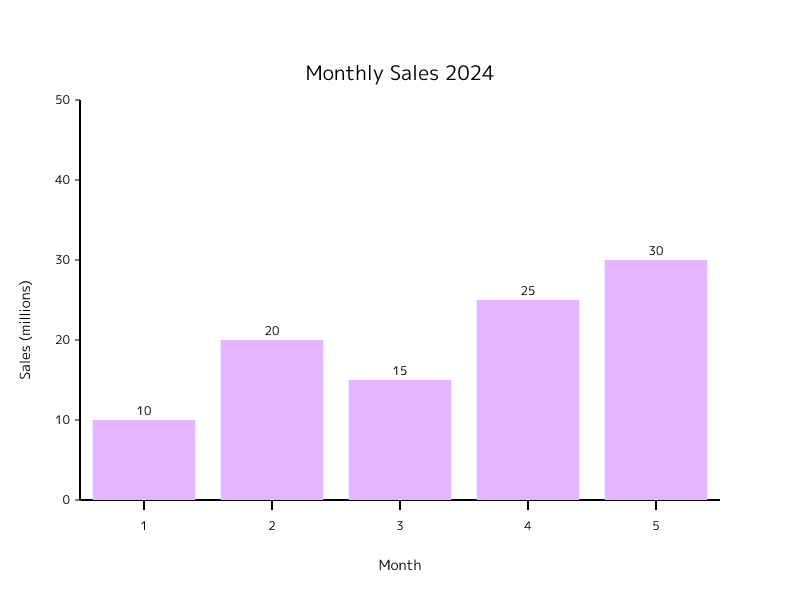

# 📊 Rust Chart Worker

🚀 A service that dynamically generates charts using Rust on Cloudflare Workers.
This service can create line graphs, bar charts, scatter plots, and more using the plotters library.
🇯🇵 Fully supports Japanese text in titles and labels using the M+ 1p font, making it perfect for both English and Japanese applications.

## 🎨 Output Examples



## ✨ Recent Improvements

### 🔤 Font Processing Improvements
- ✅ Enabled text functionality in usvg and resvg
- 📦 Implemented proper font loading and processing
- 🔄 Added text path conversion processing
- 🎯 Optimized text styling

### 📝 Font Used
This project uses [M+ 1p Font](https://mplus-fonts.osdn.jp/).
M+ 1p Font is a modern and clean Japanese font that provides excellent readability for graphs and charts.

## 🛠️ Requirements

- 🦀 Rust
- ⚡ wrangler (Cloudflare Workers CLI)
- 🔧 curl (for testing)

## 🚀 Setup

```bash
# Install wrangler
npm install -g wrangler

# Install dependencies
cargo install worker-build
```

## 🏃‍♂️ Running the Service

Start the local development server:

```bash
npx wrangler dev
```

The service will run on `http://localhost:8787` by default.

## 🧪 Test curl Commands

### 1. 📈 Line Chart (Default)


```bash
curl -X POST http://localhost:8787 \
  -H "Content-Type: application/json" \
  -d '{"graph_type": "line", "data": [10, 20, 15, 25, 30, 20, 35, 40, 30, 45]}' \
  -o images/line_chart.png
```

### 2. 📊 Bar Chart


```bash
curl -X POST http://localhost:8787 \
  -H "Content-Type: application/json" \
  -d '{"graph_type": "bar", "data": [10, 20, 15, 25, 30, 20, 35, 40, 30, 45]}' \
  -o images/bar_chart.png
```

### 3. 🔵 Scatter Plot


```bash
curl -X POST http://localhost:8787 \
  -H "Content-Type: application/json" \
  -d '{"graph_type": "scatter", "data": [10, 20, 15, 25, 30, 20, 35, 40, 30, 45]}' \
  -o images/scatter_plot.png
```

### 4. 🎨 Using Customization Options


```bash
# Specify title and axis labels
curl -X POST http://localhost:8787 \
  -H "Content-Type: application/json" \
  -d '{
    "graph_type": "bar",
    "data": [10, 20, 15, 25, 30],
    "title": "Monthly Sales 2024",
    "x_label": "Month",
    "y_label": "Sales (millions)"
  }' \
  -o images/custom_chart.png
```

### 4.1. 🇯🇵 Using Japanese Customization Options


```bash
# Specify title and axis labels in Japanese
curl -X POST http://localhost:8787 \
  -H "Content-Type: application/json" \
  -d '{
    "graph_type": "bar",
    "data": [10, 20, 15, 25, 30],
    "title": "月間売上推移 2024年",
    "x_label": "月",
    "y_label": "売上（百万円）"
  }' \
  -o images/custom_chart_ja.png
```

### 5. 〽️ Sine Wave Data Test


```bash
curl -X POST http://localhost:8787 \
  -H "Content-Type: application/json" \
  -d "{\"graph_type\": \"line\", \"data\": $(python3 -c 'import math; print([math.sin(x/10)*10 + 20 for x in range(50)])')}" \
  -o images/sine_wave.png
```

### 6. 🎲 Random Data Test


```bash
curl -X POST http://localhost:8787 \
  -H "Content-Type: application/json" \
  -d "{\"graph_type\": \"line\", \"data\": $(python3 -c 'import random; print([random.uniform(0, 100) for _ in range(20)])')}" \
  -o images/random_data.png
```

## 📚 API Specification

### 🔌 Endpoint
- POST /

### 📥 Request Body
```json
{
  "graph_type": string,  // "line", "bar", or "scatter"
  "data": number[],      // Array of data points to plot
  "title": string,       // (Optional) Graph title
  "x_label": string,     // (Optional) X-axis label (default: "Index")
  "y_label": string      // (Optional) Y-axis label (default: "Value")
}
```

### 📤 Response
- Content-Type: image/png
- Returns the generated graph image in PNG format

### ⚠️ Error Responses
- 405: Method Not Allowed - When accessed with methods other than POST
- 400: Bad Request - Invalid JSON or empty data array
- 500: Internal Server Error - Error during graph generation

## 🚀 Deployment

Deploy to Cloudflare Workers:

```bash
npx wrangler deploy
```

## 📜 License

MIT
