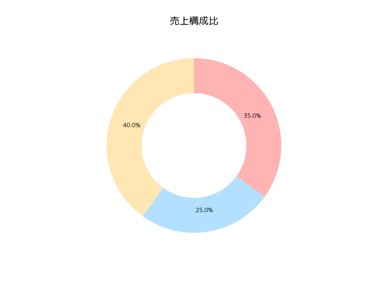

# 📊 Rust Chart Worker

🚀 A service that dynamically generates charts using Rust on Cloudflare Workers.
This service can create line graphs, bar charts, scatter plots, and more using the plotters library.
🇯🇵 Fully supports Japanese text in titles and labels using the M+ 1p font, making it perfect for both English and Japanese applications.

## 🎨 Output Examples


## ✨ Recent Improvements

### 🔤 Font Processing Improvements
- ✅ Enabled text functionality in usvg and resvg
- 📦 Implemented proper font loading and processing
- 🔄 Added text path conversion processing
- 🎯 Optimized text styling

### 📝 Font Used
This project uses [M+ 1p Font](https://mplusfonts.github.io/).
M+ 1p Font is a modern and clean Japanese font that provides excellent readability for graphs and charts.

## 🛠️ Requirements

- 🦀 Rust
- ⚡ wrangler (Cloudflare Workers CLI)
- 🔧 curl (for testing)

## 🚀 Setup

```bash
# Install wrangler
npm install -g wrangler

# Install dependencies
cargo install worker-build
```

## 🏃‍♂️ Running the Service

Start the local development server:

```bash
npx wrangler dev
```

The service will run on `http://localhost:8787` by default.

## 🧪 Test curl Commands

### 1. 📈 Line Chart (Default)


```bash
# Using GET request
curl "http://localhost:8787/api?type=line&data=10,20,15,25,30,20,35,40,30,45" \
  -o images/line_chart.png

# Using POST request
curl -X POST http://localhost:8787 \
  -H "Content-Type: application/json" \
  -d '{"graph_type": "line", "data": [10, 20, 15, 25, 30, 20, 35, 40, 30, 45]}' \
  -o images/line_chart.png
```

### 2. 📊 Bar Chart


```bash
# Using GET request
curl "http://localhost:8787/api?type=bar&data=10,20,15,25,30,20,35,40,30,45" \
  -o images/bar_chart.png

# Using POST request
curl -X POST http://localhost:8787 \
  -H "Content-Type: application/json" \
  -d '{"graph_type": "bar", "data": [10, 20, 15, 25, 30, 20, 35, 40, 30, 45]}' \
  -o images/bar_chart.png
```

### 3. 🔵 Scatter Plot


```bash
# Using GET request
curl "http://localhost:8787/api?type=scatter&data=10,20,15,25,30,20,35,40,30,45" \
  -o images/scatter_plot.png

# Using POST request
curl -X POST http://localhost:8787 \
  -H "Content-Type: application/json" \
  -d '{"graph_type": "scatter", "data": [10, 20, 15, 25, 30, 20, 35, 40, 30, 45]}' \
  -o images/scatter_plot.png
```

### 4. 🎨 Using Customization Options


```bash
# Using GET request with customization
curl "http://localhost:8787/api?type=bar&data=10,20,15,25,30&title=Monthly%20Sales%202024&x_label=Month&y_label=Sales%20(millions)" \
  -o images/custom_chart.png

# Using POST request with customization
curl -X POST http://localhost:8787 \
  -H "Content-Type: application/json" \
  -d '{
    "graph_type": "bar",
    "data": [10, 20, 15, 25, 30],
    "title": "Monthly Sales 2024",
    "x_label": "Month",
    "y_label": "Sales (millions)"
  }' \
  -o images/custom_chart.png
```

### 4.1. 🇯🇵 Using Japanese Customization Options


```bash
# Using GET request with Japanese customization
curl "http://localhost:8787/api?type=bar&data=10,20,15,25,30&title=月間売上推移%202024年&x_label=月&y_label=売上（百万円）" \
  -o images/custom_chart_ja.png

# Using POST request with Japanese customization
curl -X POST http://localhost:8787 \
  -H "Content-Type: application/json" \
  -d '{
    "graph_type": "bar",
    "data": [10, 20, 15, 25, 30],
    "title": "月間売上推移 2024年",
    "x_label": "月",
    "y_label": "売上（百万円）"
  }' \
  -o images/custom_chart_ja.png
```

### 5. 〽️ Sine Wave Data Test


```bash
# Using GET request
curl "http://localhost:8787/api?type=line&data=$(python3 -c 'import math; print(",".join(str(math.sin(x/10)*10 + 20) for x in range(50)))')" \
  -o images/sine_wave.png

# Using POST request
curl -X POST http://localhost:8787 \
  -H "Content-Type: application/json" \
  -d "{\"graph_type\": \"line\", \"data\": $(python3 -c 'import math; print([math.sin(x/10)*10 + 20 for x in range(50)])')}" \
  -o images/sine_wave.png
```

### 6. 🎲 Random Data Test


```bash
# Using GET request
curl "http://localhost:8787/api?type=line&data=$(python3 -c 'import random; print(",".join(str(random.uniform(0, 100)) for _ in range(20)))')" \
  -o images/random_data.png

# Using POST request
curl -X POST http://localhost:8787 \
  -H "Content-Type: application/json" \
  -d "{\"graph_type\": \"line\", \"data\": $(python3 -c 'import random; print([random.uniform(0, 100) for _ in range(20)])')}" \
  -o images/random_data.png
```

### 7. 🥧 Pie Chart


```bash
# Using GET request with labels and colors
curl "http://localhost:8787/api?type=pie&data=30,20,50&labels=A,B,C&colors=%23FF6384,%2336A2EB,%23FFCE56&title=Distribution" \
  -o images/pie_chart.png

# Using POST request with labels and colors
curl -X POST http://localhost:8787 \
  -H "Content-Type: application/json" \
  -d '{
    "graph_type": "pie",
    "series": [{
      "data": [
        {"value": 30, "label": "A", "color": "#FF6384"},
        {"value": 20, "label": "B", "color": "#36A2EB"},
        {"value": 50, "label": "C", "color": "#FFCE56"}
      ]
    }],
    "title": "Distribution"
  }' \
  -o images/pie_chart.png
```

### 8. 🍩 Donut Chart



```bash
# Using GET request with Japanese labels
curl "http://localhost:8787/api?type=donut&data=35,25,40&labels=製品A,製品B,製品C&colors=%23FF6384,%2336A2EB,%23FFCE56&title=売上構成比" \
  -o images/donut_chart.png

# Using POST request with Japanese labels
curl -X POST http://localhost:8787 \
  -H "Content-Type: application/json" \
  -d '{
    "graph_type": "donut",
    "series": [{
      "data": [
        {"value": 35, "label": "製品A", "color": "#FF6384"},
        {"value": 25, "label": "製品B", "color": "#36A2EB"},
        {"value": 40, "label": "製品C", "color": "#FFCE56"}
      ]
    }],
    "title": "売上構成比"
  }' \
  -o images/donut_chart.png
```

### 9. 📈 Area Chart


```bash
# Using GET request with multiple series
curl "http://localhost:8787/api?type=area&data=30,40,35,50,45,20,25,30,35,40&labels=Week1,Week2,Week3,Week4,Week5&colors=%23FF6384,%2336A2EB&title=Team%20Performance&x_label=Week&y_label=Score" \
  -o images/area_chart.png

# Using POST request with multiple series
curl -X POST http://localhost:8787 \
  -H "Content-Type: application/json" \
  -d '{
    "graph_type": "area",
    "series": [
      {
        "name": "Team A",
        "color": "#FF6384",
        "data": [
          {"value": 30}, {"value": 40}, {"value": 35}, {"value": 50}, {"value": 45}
        ]
      },
      {
        "name": "Team B",
        "color": "#36A2EB",
        "data": [
          {"value": 20}, {"value": 25}, {"value": 30}, {"value": 35}, {"value": 40}
        ]
      }
    ],
    "title": "Team Performance",
    "x_label": "Week",
    "y_label": "Score"
  }' \
  -o images/area_chart.png
```

### 10. 🎯 Radar Chart


```bash
# Using GET request with labels
curl "http://localhost:8787/api?type=radar&data=80,70,90,85,75,70,85,75,80,90&labels=Attack,Defense,Speed,Technique,Stamina&colors=%23FF6384,%2336A2EB&title=Player%20Stats%20Comparison" \
  -o images/radar_chart.png

# Using POST request with labels
curl -X POST http://localhost:8787 \
  -H "Content-Type: application/json" \
  -d '{
    "graph_type": "radar",
    "series": [
      {
        "name": "Player 1",
        "color": "#FF6384",
        "data": [
          {"value": 80, "label": "Attack"},
          {"value": 70, "label": "Defense"},
          {"value": 90, "label": "Speed"},
          {"value": 85, "label": "Technique"},
          {"value": 75, "label": "Stamina"}
        ]
      },
      {
        "name": "Player 2",
        "color": "#36A2EB",
        "data": [
          {"value": 70, "label": "Attack"},
          {"value": 85, "label": "Defense"},
          {"value": 75, "label": "Speed"},
          {"value": 80, "label": "Technique"},
          {"value": 90, "label": "Stamina"}
        ]
      }
    ],
    "title": "Player Stats Comparison"
  }' \
  -o images/radar_chart.png
```

## 📚 API Specification

### 🔌 Endpoints
- GET /api
- POST /

### 📥 Request Format
#### GET Request Query Parameters
```
type: string      // "line", "bar", "scatter", "pie", "donut", "area", "radar" (default: "line")
data: string      // Comma-separated data points (e.g., "10,20,30")
labels: string    // (Optional) Comma-separated labels for data points
colors: string    // (Optional) Comma-separated colors in hex format (URL encoded, e.g., %23FF6384 for #FF6384)
title: string     // (Optional) Graph title
x_label: string   // (Optional) X-axis label
y_label: string   // (Optional) Y-axis label
```

#### POST Request Body
```json
{
  "graph_type": string,  // "line", "bar", "scatter", "pie", "donut", "area", "radar"
  "data": number[],      // Array of data points (legacy format)
  "series": [            // New format with enhanced features
    {
      "name": string,    // (Optional) Series name
      "color": string,   // (Optional) Series color in hex format
      "data": [
        {
          "value": number,   // Data point value
          "label": string,   // (Optional) Data point label
          "color": string    // (Optional) Data point color in hex format
        }
      ]
    }
  ],
  "title": string,       // (Optional) Graph title
  "x_label": string,     // (Optional) X-axis label
  "y_label": string      // (Optional) Y-axis label
}
```

### 🎨 Color Customization
- Default color palette: ["#FF6384", "#36A2EB", "#FFCE56", "#4BC0C0", "#9966FF", "#FF9F40"]
- Colors can be specified at both series and individual data point level
- Data point color takes precedence over series color

### 📊 Chart Type Features
- 📈 Line Chart: Basic line chart with data points
- 📊 Bar Chart: Vertical bar chart
- 🔵 Scatter Plot: Data points without connecting lines
- 🥧 Pie Chart: Circular statistical chart
- 🍩 Donut Chart: Pie chart with center hole
- 📈 Area Chart: Line chart with filled area below
- 🎯 Radar Chart: Multi-variable data on a circular graph

### ⚠️ Error Responses
- 405: Method Not Allowed - When accessed with methods other than GET or POST
- 400: Bad Request - Invalid JSON/parameters or empty data array
- 500: Internal Server Error - Error during graph generation

## 🚀 Deployment

Deploy to Cloudflare Workers:

```bash
# Development
npx wrangler dev
# The service will run on http://localhost:8787

# Production Deployment
npx wrangler deploy
# This will deploy to https://<your-worker>.workers.dev
```

### 📦 Deployment Size
- Total Upload: ~4.7 MB (gzip: ~2.1 MB)
- Worker Startup Time: ~5 ms
- ✨ Fits within Cloudflare Workers' free tier limits!

The deployment size includes the WASM binary and the embedded font file. Despite including a full-featured font for Japanese text support, the worker still comfortably fits within Cloudflare Workers' free tier limits.

## 📜 License

MIT
