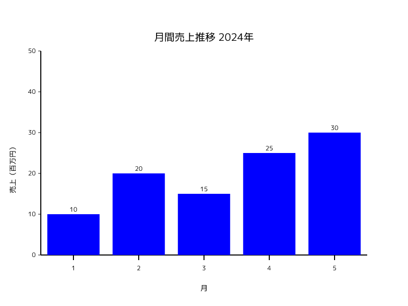
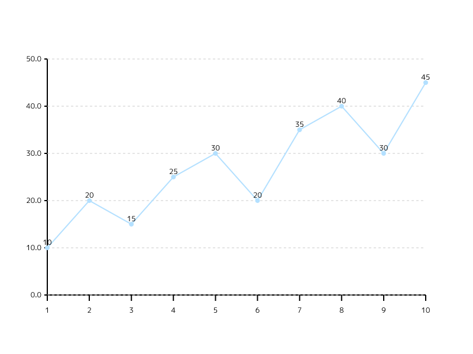
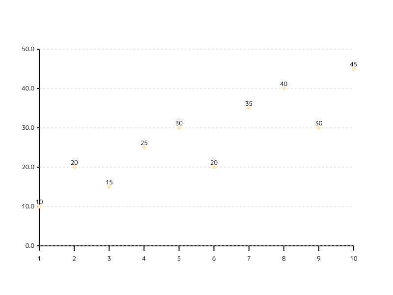
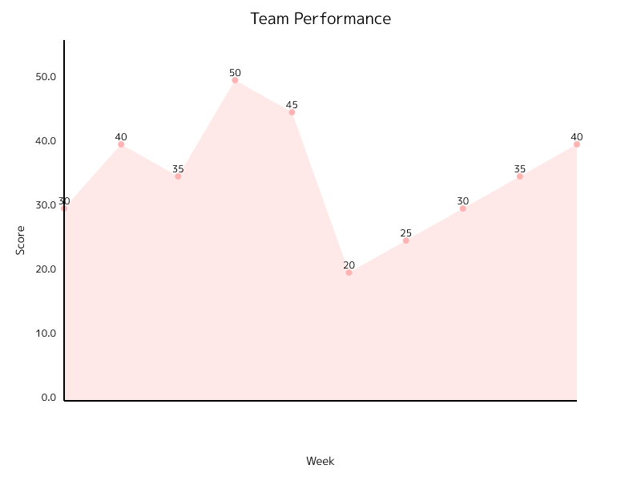

# 📊 Rust Chart Worker

🚀 A service that dynamically generates charts using Rust on Cloudflare Workers.
This service can create line graphs, bar charts, scatter plots, and more using the plotters library.
🇯🇵 Fully supports Japanese text in titles and labels using the M+ 1p font, making it perfect for both English and Japanese applications.

## 🎨 Output Examples

Note: Sample images below were refreshed from the production deployment on 2025-09-16.



## ✨ Recent Improvements

### 🔤 Font Processing Improvements
- ✅ Enabled text functionality in usvg and resvg
- 📦 Implemented proper font loading and processing
- 🔄 Added text path conversion processing
- 🎯 Optimized text styling

### 📝 Font Used
This project uses [M+ 1p Font](https://mplusfonts.github.io/).
M+ 1p Font is a modern and clean Japanese font that provides excellent readability for graphs and charts.

## 🛠️ Requirements

- 🦀 Rust
- ⚡ wrangler (Cloudflare Workers CLI)
- 🔧 curl (for testing)

## 🚀 Setup

```bash
# Install wrangler
npm install -g wrangler

# Install dependencies
cargo install worker-build
```

## 🏃‍♂️ Running the Service

Start the local development server:

```bash
npx wrangler dev
```

The service will run on `http://localhost:8787` by default.

## 🧪 Test curl Commands

### 1. 📈 Line Chart (Default)



```bash
# Using GET request
curl "http://localhost:8787/api?type=line&data=10,20,15,25,30,20,35,40,30,45&colors=%23B3E0FF" \
  -o images/line_chart.png

# Using POST request
curl -X POST http://localhost:8787 \
  -H "Content-Type: application/json" \
  -d '{
    "graph_type": "line",
    "data": [10, 20, 15, 25, 30, 20, 35, 40, 30, 45],
    "color": "#B3E0FF"
  }' \
  -o images/line_chart.png
```

### 2. 📊 Bar Chart


```bash
# Using GET request
curl "http://localhost:8787/api?type=bar&data=10,20,15,25,30,20,35,40,30,45&colors=%23FFB3B3" \
  -o images/bar_chart.png

# Using POST request
curl -X POST http://localhost:8787 \
  -H "Content-Type: application/json" \
  -d '{
    "graph_type": "bar",
    "data": [10, 20, 15, 25, 30, 20, 35, 40, 30, 45],
    "color": "#FFB3B3"
  }' \
  -o images/bar_chart.png
```

### 3. 🔵 Scatter Plot



```bash
# Using GET request
curl "http://localhost:8787/api?type=scatter&data=10,20,15,25,30,20,35,40,30,45&colors=%23FFE6B3" \
  -o images/scatter_plot.png

# Using POST request
curl -X POST http://localhost:8787 \
  -H "Content-Type: application/json" \
  -d '{
    "graph_type": "scatter",
    "data": [10, 20, 15, 25, 30, 20, 35, 40, 30, 45],
    "color": "#FFE6B3"
  }' \
  -o images/scatter_plot.png
```

### 4. 🎨 Using Customization Options


```bash
# Using GET request with customization
curl "http://localhost:8787/api?type=bar&data=10,20,15,25,30&title=Monthly%20Sales%202024&x_label=Month&y_label=Sales%20(millions)&colors=%23E6B3FF" \
  -o images/custom_chart.png

# Using POST request with customization
curl -X POST http://localhost:8787 \
  -H "Content-Type: application/json" \
  -d '{
    "graph_type": "bar",
    "data": [10, 20, 15, 25, 30],
    "title": "Monthly Sales 2024",
    "x_label": "Month",
    "y_label": "Sales (millions)",
    "color": "#E6B3FF"
  }' \
  -o images/custom_chart.png
```

### 4.1. 🇯🇵 Using Japanese Customization Options


```bash
# Using GET request with Japanese customization
curl "http://localhost:8787/api?type=bar&data=10,20,15,25,30&title=月間売上推移%202024年&x_label=月&y_label=売上（百万円）" \
  -o images/custom_chart_ja.png

# Using POST request with Japanese customization
curl -X POST http://localhost:8787 \
  -H "Content-Type: application/json" \
  -d '{
    "graph_type": "bar",
    "data": [10, 20, 15, 25, 30],
    "title": "月間売上推移 2024年",
    "x_label": "月",
    "y_label": "売上（百万円）"
  }' \
  -o images/custom_chart_ja.png
```

### 5. 🥧 Pie Chart


```bash
# Using GET request with labels and colors
curl "http://localhost:8787/api?type=pie&data=30,20,50&labels=A,B,C&colors=%23FFB3B3,%23B3E0FF,%23FFE6B3&title=Distribution" \
  -o images/pie_chart.png

# Using POST request with labels and colors
curl -X POST http://localhost:8787 \
  -H "Content-Type: application/json" \
  -d '{
    "graph_type": "pie",
    "series": [{
      "data": [
        {"value": 30, "label": "A", "color": "#FFB3B3"},
        {"value": 20, "label": "B", "color": "#B3E0FF"},
        {"value": 50, "label": "C", "color": "#FFE6B3"}
      ]
    }],
    "title": "Distribution"
  }' \
  -o images/pie_chart.png
```

### 8. 🍩 Donut Chart


```bash
# Using GET request with labels and colors
curl "http://localhost:8787/api?type=donut&data=35,25,40&labels=製品A,製品B,製品C&colors=%23FFB3B3,%23B3E0FF,%23FFE6B3&title=売上構成比" \
  -o images/donut_chart.png

# Using POST request with labels and colors
curl -X POST http://localhost:8787 \
  -H "Content-Type: application/json" \
  -d '{
    "graph_type": "donut",
    "series": [{
      "data": [
        {"value": 35, "label": "製品A", "color": "#FFB3B3"},
        {"value": 25, "label": "製品B", "color": "#B3E0FF"},
        {"value": 40, "label": "製品C", "color": "#FFE6B3"}
      ]
    }],
    "title": "売上構成比"
  }' \
  -o images/donut_chart.png
```

### 9. 📈 Area Chart



```bash
# Using GET request with multiple series
curl "http://localhost:8787/api?type=area&data=30,40,35,50,45,20,25,30,35,40&labels=Week1,Week2,Week3,Week4,Week5&colors=%23FFB3B3,%23B3E0FF&title=Team%20Performance&x_label=Week&y_label=Score" \
  -o images/area_chart.png

# Using POST request with multiple series
curl -X POST http://localhost:8787 \
  -H "Content-Type: application/json" \
  -d '{
    "graph_type": "area",
    "series": [
      {
        "name": "Team A",
        "color": "#FFB3B3",
        "data": [
          {"value": 30}, {"value": 40}, {"value": 35}, {"value": 50}, {"value": 45}
        ]
      },
      {
        "name": "Team B",
        "color": "#B3E0FF",
        "data": [
          {"value": 20}, {"value": 25}, {"value": 30}, {"value": 35}, {"value": 40}
        ]
      }
    ],
    "title": "Team Performance",
    "x_label": "Week",
    "y_label": "Score"
  }' \
  -o images/area_chart.png
```

### 10. 🎯 Radar Chart


```bash
# Using GET request with labels
curl "http://localhost:8787/api?type=radar&data=80,70,90,85,75,70,85,75,80,90&labels=Attack,Defense,Speed,Technique,Stamina&colors=%23FF6384,%2336A2EB&title=Player%20Stats%20Comparison" \
  -o images/radar_chart.png

# Using POST request with labels
curl -X POST http://localhost:8787 \
  -H "Content-Type: application/json" \
  -d '{
    "graph_type": "radar",
    "series": [
      {
        "name": "Player 1",
        "color": "#FF6384",
        "data": [
          {"value": 80, "label": "Attack"},
          {"value": 70, "label": "Defense"},
          {"value": 90, "label": "Speed"},
          {"value": 85, "label": "Technique"},
          {"value": 75, "label": "Stamina"}
        ]
      },
      {
        "name": "Player 2",
        "color": "#36A2EB",
        "data": [
          {"value": 70, "label": "Attack"},
          {"value": 85, "label": "Defense"},
          {"value": 75, "label": "Speed"},
          {"value": 80, "label": "Technique"},
          {"value": 90, "label": "Stamina"}
        ]
      }
    ],
    "title": "Player Stats Comparison"
  }' \
  -o images/radar_chart.png
```

### 11. 📊 マルチシリーズの例

#### 11.1 📈 マルチシリーズ折れ線グラフ


```bash
curl -X POST http://localhost:8787 \
  -H "Content-Type: application/json" \
  -d '{
    "graph_type": "line",
    "series": [
      {
        "name": "Team A",
        "color": "#FF6384",
        "data": [
          {"value": 30}, {"value": 40}, {"value": 35}, {"value": 50}, {"value": 45}
        ]
      },
      {
        "name": "Team B",
        "color": "#36A2EB",
        "data": [
          {"value": 20}, {"value": 25}, {"value": 30}, {"value": 35}, {"value": 40}
        ]
      }
    ],
    "title": "Team Performance Comparison",
    "x_label": "Week",
    "y_label": "Score"
  }' \
  -o images/multi_series_line.png
```

#### 11.2 📊 マルチシリーズ棒グラフ


```bash
curl -X POST http://localhost:8787 \
  -H "Content-Type: application/json" \
  -d '{
    "graph_type": "bar",
    "series": [
      {
        "name": "2023年",
        "color": "#FF6384",
        "data": [
          {"value": 100}, {"value": 120}, {"value": 130}, {"value": 110}
        ]
      },
      {
        "name": "2024年",
        "color": "#36A2EB",
        "data": [
          {"value": 110}, {"value": 130}, {"value": 140}, {"value": 120}
        ]
      }
    ],
    "title": "四半期売上比較",
    "x_label": "四半期",
    "y_label": "売上（百万円）"
  }' \
  -o images/multi_series_bar.png
```

#### 11.3 📈 マルチシリーズエリアチャート


```bash
curl -X POST http://localhost:8787 \
  -H "Content-Type: application/json" \
  -d '{
    "graph_type": "area",
    "series": [
      {
        "name": "Desktop",
        "color": "#FF6384",
        "data": [
          {"value": 50}, {"value": 55}, {"value": 60}, {"value": 58}, {"value": 62}
        ]
      },
      {
        "name": "Mobile",
        "color": "#36A2EB",
        "data": [
          {"value": 30}, {"value": 35}, {"value": 40}, {"value": 45}, {"value": 48}
        ]
      }
    ],
    "title": "デバイス別アクセス数",
    "x_label": "月",
    "y_label": "アクセス数（万）"
  }' \
  -o images/multi_series_area.png
```

#### 11.4 🎯 マルチシリーズレーダーチャート


```bash
curl -X POST http://localhost:8787 \
  -H "Content-Type: application/json" \
  -d '{
    "graph_type": "radar",
    "series": [
      {
        "name": "Product A",
        "color": "#FFB3B3",
        "data": [
          {"value": 80, "label": "Quality"},
          {"value": 70, "label": "Price"},
          {"value": 90, "label": "Design"},
          {"value": 85, "label": "Features"},
          {"value": 75, "label": "Support"}
        ]
      },
      {
        "name": "Product B",
        "color": "#B3E0FF",
        "data": [
          {"value": 70, "label": "Quality"},
          {"value": 85, "label": "Price"},
          {"value": 75, "label": "Design"},
          {"value": 80, "label": "Features"},
          {"value": 90, "label": "Support"}
        ]
      }
    ],
    "title": "製品比較分析"
  }' \
  -o images/multi_series_radar.png
```
