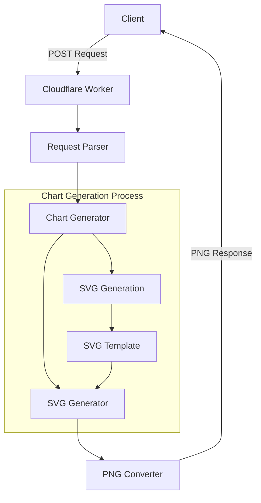

# Rust Chart Worker Architecture Documentation

## Overview
This project is a Rust-based chart generation service running on Cloudflare Workers.
It receives HTTP requests and dynamically generates charts, returning them in PNG format.

## Architecture Diagram



## Libraries and Their Roles

### Core Functionality
- `worker` (v0.5.0): Rust bindings for Cloudflare Workers
- `serde` (v1.0): JSON serialization/deserialization

### SVG/PNG Conversion
- `resvg` (v0.35.0): SVG rendering engine
- `tiny-skia` (v0.10.0): 2D graphics library
- `usvg` (v0.35.0): SVG parser and toolkit
- `usvg-text-layout` (v0.35.0): SVG text layout processing

### Others
- `fontdb` (v0.14.1): Font management
- `getrandom` (v0.2): Random number generation (JavaScript environment compatible)

## Technical Features

### SVG Generation
The chart generation process:
1. Direct SVG generation for optimal performance
2. Custom SVG templates for each chart type
3. Enhanced customization capabilities

### Font Processing
- Embedded free-to-use fonts
- Font management using `fontdb` for consistent text rendering

### Chart Types
Currently supported chart types:
- Bar Chart
- Scatter Plot
- Line Graph
- Pie Chart
- Radar Chart
- Area Chart

## API Specification

### Request Format
```json
{
    "graph_type": "bar|scatter|line|pie|radar|area",
    "data": [numeric array],
    "title": "Chart Title (optional)",
    "x_label": "X-Axis Label (optional)",
    "y_label": "Y-Axis Label (optional)"
}
```

### Response
- Content-Type: image/png
- Success: PNG image data
- Error: Error message with status code

## Security Considerations
- POST method only
- Input data validation
- Memory usage limits
