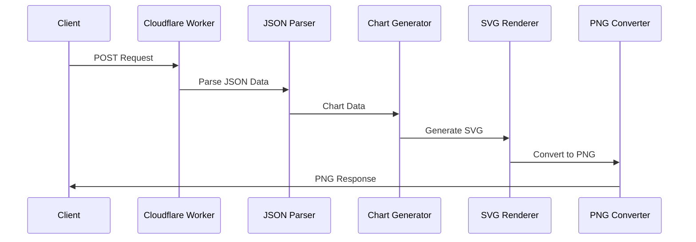

# Implementation Details

## Chart Generation Process



## Component Details

### 1. Request Handling
```rust
#[event(fetch)]
pub async fn main(mut req: Request, _env: Env, _ctx: Context) -> Result<Response>
```
- POST method validation
- JSON data parsing
- Error handling

### 2. Chart Generation
```rust
fn create_chart(graph_req: &GraphRequest) -> core::result::Result<Vec<u8>, String>
```
- Layout configuration
- Chart type-specific processing
- SVG template generation

### 3. SVG Generation Process

#### Bar Chart
```rust
fn generate_bar_chart_svg(data: &[f64]) -> String
```
- Bar width and height calculation
- Scaling process
- Label placement

#### Scatter Plot
```rust
fn generate_scatter_chart_svg(data: &[f64]) -> String
```
- Point placement
- Data label generation

#### Line Graph
```rust
fn generate_line_chart_svg(data: &[f64]) -> String
```
- Path data generation
- Point marker placement

### 4. PNG Conversion Process
- SVG rasterization using `resvg`
- Font embedding process
- Memory optimization

## Performance Optimization

### Memory Usage
- Optimized string concatenation for SVG generation
- Appropriate buffer size management
- Efficient memory deallocation

### Rendering Speed
- Efficient SVG path generation
- PNG conversion buffer management
- Caching strategy

## Error Handling

### Input Validation
- Empty data array check
- Numeric range validation
- Chart type validation

### Error Response
- Appropriate HTTP status codes
- Error message generation
- Debug information management

## Future Extensibility

### Planned Features
1. Multi-series support
2. Custom color palettes
3. Animation support
4. Interactive elements

### Optimization Areas
1. Parallel SVG generation
2. Improved caching strategy
3. Memory usage optimization
